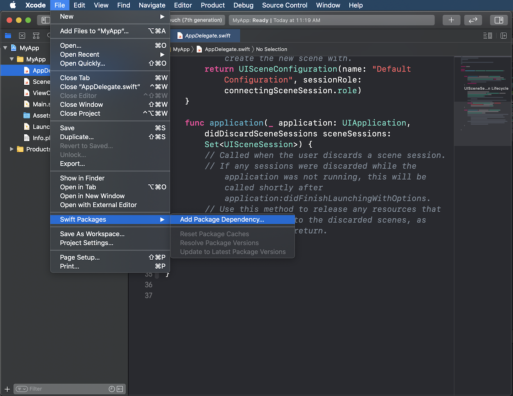

# Overview

This is the package repository for adding __[ArcGIS Runtime SDK for iOS](https://developers.arcgis.com/ios/)__ to your project using Swift Package Manager (SPM).

## Instructions
1. Open your project in Xcode
2. Go to _File_ menu > _Swift Packages_ > _Add Package Dependency_ option
   
3. Enter `https://github.com/Esri/arcgis-runtime-ios/` as the package repository URL
4. Choose a specific version or the latest version. Click Next.

That's it. ArcGIS Runtime SDK for iOS has been integrated into your project as a Swift Package. 

Try out some of the tutorials.

## Requirements
- Xcode 12.0 or newer

## Resources
- [ArcGIS Runtime SDK for iOS](https://developers.arcgis.com/ios/)
- [Swift Package Manager](https://swift.org/package-manager/)

## Issues
Find a bug or want to request a new feature? Please let us know by submitting an issue.

